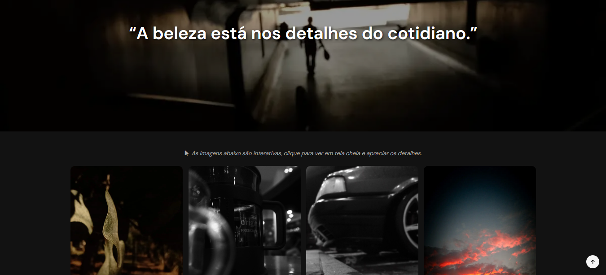

# Pelas Ruas
O Pelas Ruas é um projeto fotográfico colaborativo criado por amigos apaixonados por capturar a essência do cotidiano urbano. A proposta é transformar momentos simples das ruas em narrativas visuais marcantes, através de uma galeria interativa, elegante e totalmente responsiva.

## Preview

## Demonstração das Animações

## Stack Tecnológica
- HTML5
- CSS3
- Bootstrap 5
- JavaScript (Vanilla JS)
- Fancybox
- AOS
- Swiper
- Vanilla Tilt

## Como executar o projeto
- Clone o repositório
git clone https://github.com/seu-usuario/pelas-ruas.git

- Acesse a pasta
cd pelas-ruas

- Instale as dependências
npm install

- Rode o projeto
npm run dev

## Status do projeto
Finalizado.
Estrutura base implementada com evolução contínua dos componentes e refinamento das animações.
